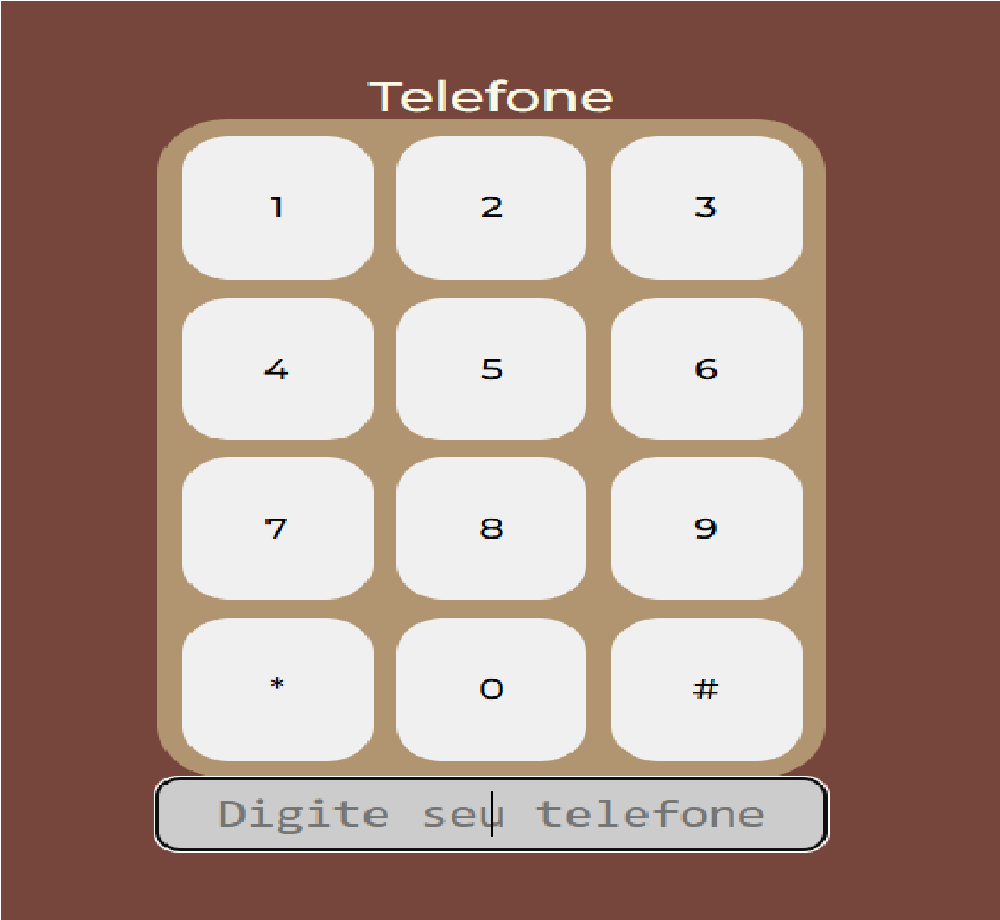

# Telefone

Representação de um telefone com suas devidas teclas.

## 🔨 Funcionalidades do projeto

O objetivo deste projeto é aprimorar as habilidades em HTML, CSS e Javascript.

## ✔️ Técnicas e tecnologias utilizadas

-`HTML`
-`CSS`
-`Javascript`

## 🛠️ Abrir e rodar o projeto

Para abrir e rodar o projeto, utilize um editor de código de sua escolha.
Depois, abra o projeto no seu navegador.

## VERCEL 
https://telefone-two.vercel.app/
